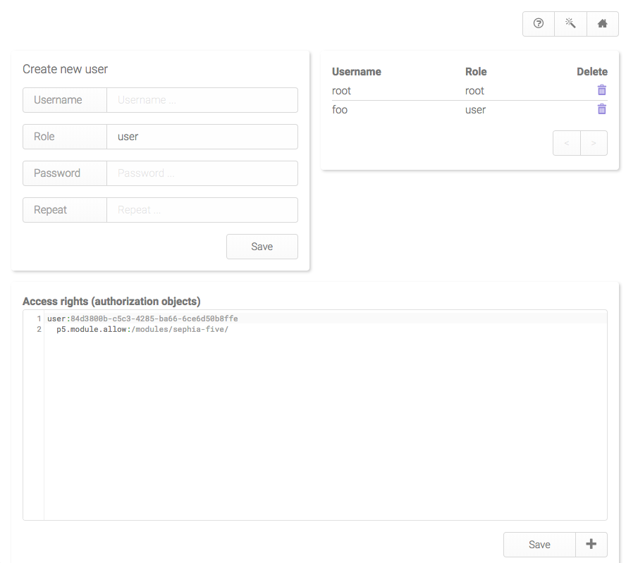

# Peeples, authorization and authentication

This is the user management module for [Phosphorus Five](https://github.com/polterguy/phosphorusfive). It allows you 
to create, view, edit, and delete users in your Phosphorus Five installation - In addition to explicitly granting or
denying access to objects, such as modules, files, and folders, ets.



## Installation

The easiest way to install it, is to [install phosphorus five](https://github.com/polterguy/phosphorusfive),
for then to visit _"The Bazar"_, and simply install it through the Bazar on your local machine/server.
However, if you want a more manual installation path, you can download the latest release,
unzip it, and move the unzipped root folder into your _"core/p5.webapp/modules"_ folder. If you
choose this path, you should rename the folder, removing any version information, making sure
your module folder is called exactly _"peeples"_. Installation through the Bazar
requires you to have some sort of GnuPG client on your machine/server. If you don't want
to fiddle with installing GnuPG, you can also download the latest zip file release directly.

## How it works

Peeples allows you to create, edit, and delete users in your Phosphorus Five installation. This part is probably easily 
understood, and relatively intuitive. The slightly more complex parts of Peeples, is granting roles or denying roles 
access to objects, which you want to restrict access to for some reasons. An example might be a module, which you only
want users belonging to the _"developer"_ role to be able to access.

By default, all users, also logged in users, are denied access to all modules. To explicitly open up access to a role,
you need to create an _"access object"_, and associate it with a role. To for instance grant access to all _"developer"_
users to the _"hyper-ide"_ module, you could create such an access object with the following Hyperlambda.

```
developer
  p5.module.allow:/modules/hyper-ide/
```

The above Hyperlambda would grant access to the module called _"hyper-ide"_ to all users belonging to the _"developer"_
role. If you wish, there's a wizard button you can click to grant access like the above example, which you can find beneath
the access control objects, at the bottom of your page. This button makes it easier for you to grant access to a module.

If you wish, you can also allow all users access to some specific module, by using the asterix (\*) declaration, instead
of an explicitly named role. In addition, you can restrict access to a module for specific roles too, by 
using **[p5.modules.deny]** instead of **[p5.modules.allow]**. By combining these constructs, you can for instance give
access to all users, except some explicitly named role(s). To for instance grant access to _"sephia-five"_ for all
users, except users belonging to the _"guest"_ role, you could use something such as the following.

```
guest
  p5.module.deny:/modules/sephia-five/
*
  p5.module.allow:/modules/sephia-five/
```

The above allows access to all users, then it denies access to the _"guest"_ role. This makes a lot of sense in fact, since
the _"guest"_ role is not a real role per se, but in fact the impersonated role, used by some random visitor to your web site.
All explicitly named access objects, referencing an actual existing role, instead of the asterix (\*) role, will be
given precedence when access is to be determined. This implies for our above example, that all roles would first be
allowed access, for then be denied access if the role of the user is _"guest"_. The order of your access objects, has
no meaning in such a regard.

### Other types of access objects

Since the access object system in Phosphorus Five is extendible, it is impossible to document all possible permutations
of it. However, one access type is probably of particular interest, which is access to reading and writing files. If you want
a particular role to have access to for instance writing to some specific file or folder on disc, you could accomplish that 
with the following access object.

```
developer
  p5.io.write-file.allow:/modules/
```

The above access control object will give all users in the _"developer"_ role write access to any file beneath 
your _"/modules/"_ folder. The 6 most important access object types are as follows.

* __[p5.module.allow]__ - Grants access to module
* __[p5.module.deny]__ - Denies access to module
* __[p5.io.read-file.allow]__ - Allows access to reading from a folder or a file
* __[p5.io.read-file.deny]__ - Denies access to reading from a folder or a file
* __[p5.io.write-file.allow]__ - Allows access to modify a folder or a file
* __[p5.io.write-file.deny]__ - Denies access to modify a folder or a file

### Access object's IDs

Each access object will be given an automatically assigned ID, unless you explicitly give it one yourself. This is necessary
in order to be able to delete specifically named access objects. The default ID of an access object, is the string 
representation of a GUID. If you provide an explicit ID, it must be unique for your server.

## License

Peeples is licensed under the terms of the GNU GPL version 3. See the attached LICENSE file for details.

There also exists [commercial sub-licensing options](https://gaiasoul.com/license/) for those wanting to sub-license Peeples. 
You are also welcome to send me an email at thomas@gaiasoul.com - If you'd like to speak to me about commercial venues, or other issues.
