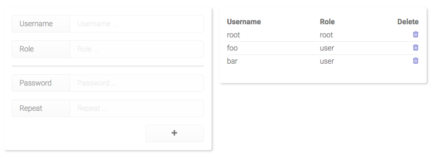

# Peeples, user management for Phosphorus Five

This is the user management module for [Phosphorus Five](https://github.com/polterguy/phosphorusfive), that allows you to
manage your users. It allows you to create, view, edit, and delete users in your Phosphorus Five installation.

If you wish to have multiple users in your Phosphorus Five installation, this is probably your choice
of module.

## Installation

The easiest way to install it, is to [install phosphorus five](https://github.com/polterguy/phosphorusfive),
for then to visit _"The Bazar"_, and simply install it through the Bazar on your local machine/server.
However, if you want a more manual installation path, you can download the latest release,
unzip it, and move the unzipped root folder into your _"core/p5.webapp/modules"_ folder. If you
choose this path, you should rename the folder, removing any version information, making sure
your module folder is called exactly _"peeples"_. Installation through the Bazar
also requires you having some sort of GnuPG client on your machine/server. If you don't want
to fiddle with installing GnuPG, you can resort to download the latest zip file release directly.

## License

Peeples is licensed under the terms of the GNU GPL version 3. See the attached LICENSE file for details.

There also exists [commercial sub-licensing options](https://gaiasoul.com/license/) for those wanting to sub-license Peeples. 
You are also welcome to send me an email at thomas@gaiasoul.com - If you'd like to speak to me about commercial venues, or other issues.
